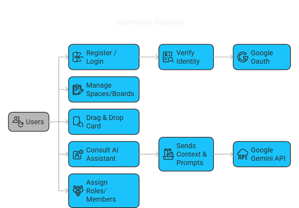

<h1 align="center">
  Samwise - AI-Enhanced Project Management Tool<br/>
</h1>

<div align="center">
  
</div>

## Description

Samwise is an open-source, intelligent project management platform designed to democratize advanced productivity features for small teams and freelancers. Built on the MERN stack with TypeScript, it integrates Generative AI (Google Gemini) directly into a Kanban workflow to automate decision-making, prioritize tasks, and reduce management overhead.

## 🌐 Live Demo

<h1 align="center">
 <a href="https://samwise-pmt.vercel.app/" target="_blank">Samwise</a>
</h1>
(Note: The initial load may take up to 60 seconds as the free-tier backend spins up.)

## 📚 Project Documentation

For a detailed breakdown of the system design and management artifacts, please refer to the documentation in the `/docs` folder:

- [System Architecture](/docs/architecture.md)
- [Setup Guide](/docs/setup.md)

## 🚀 Key Features

🤖 AI Consultant: Built-in chatbot powered by Google Gemini to analyze boards, suggest breakdowns, and auto-categorize tasks.

📋 Advanced Kanban: Drag-and-drop interface for Cards and Lists with optimistic UI updates.

⚡ Real-Time Collaboration: Instant updates across all users via Socket.io (see cards move live!).

🏢 Workspace Hierarchy: Organized structure: User -> Space -> Board -> List -> Card.

🔐 Secure Auth: Dual-token authentication (Access/Refresh JWT) with Google OAuth integration.

👥 Role-Based Access: Granular permissions (Admin, Normal, Observer) for Boards and Spaces.

📊 Smart Priority: Automatic priority calculation based on task descriptions and due dates.

### 📋 Project Management Artifacts

- [Work Breakdown Structure (WBS)](./docs/diagrams/wbs.png)
- [Entity Relationship Diagram (ERD)](./docs/diagrams/erd.jpg)
- [System Sequence Diagram](./docs/diagrams/sequence.png)
- [State Transition Diagram](./docs/diagrams/state.jpg)

---

### Architecture Overview



---

## 🛠️ Tech Stack

### Frontend:

- React (Vite)

- Redux Toolkit (State Management)

- Tailwind CSS (Styling)

- React Beautiful DnD (Drag and Drop)

### Backend:

- Socket.io (Real-time WebSockets)

- Mongoose (ODM)

- NLP.js (Local AI Classification)

### Database & DevOps:

- MongoDB (Database)

- Docker (Containerization)

## ⚙️ Installation & Setup

` You can run Samwise locally using either Docker (recommended) or npm.`

### Prerequisites

- Node.js (v16+)

- MongoDB Atlas Account (or local Mongo instance)

- Google Cloud Console Project (for OAuth)

- Google Gemini API Key

### Method 1: Docker (Quick Start)

1. Clone the repository:

```

git clone https://github.com/Sam-mx/Project-Management_Tool.git
cd samwise-project

```

2. Create Environment Variables: Create a `.env` file in the root directory and populate it (see Environment Variables section below).

3. Run with Docker Compose:

```

docker-compose up --build

```

The app will be available at http://localhost:3000.

### Method 2: Manual Setup

1. Backend Setup:

```

cd server

npm install

# Create server/.env file

npm run dev

```

2. Frontend Setup:

```

cd client

npm install

# Create client/.env file

npm run dev

```

## 🔑 Environment Variables

Server (`server/.env`)

```
PORT=5000

MONGODB_URI=mongodb+srv://<user>:<password>@cluster.mongodb.net/samwise

JWT_SECRET=your_super_secret_key

REFRESH_TOKEN_SECRET=your_refresh_secret_key

GOOGLE_CLIENT_ID=your_google_client_id

GOOGLE_CLIENT_SECRET=your_google_client_secret

GEMINI_API_KEY=your_gemini_api_key

CLIENT_URL=http://localhost:3000
```

Client (`client/.env`)

```
VITE_API_BASE_URL=http://localhost:5000/api

VITE_GOOGLE_CLIENT_ID=your_google_client_id

VITE_UNSPLASH_ACCESS_KEY=your_unsplash_key
```

## 🧪 Testing

To run the test suite (Unit & Integration):

```
cd client
npm test
```

## 👤 Author

<h2>
 <a href="https://www.linkedin.com/in/san-shwe-sam-564a32169/" target="_blank">San Shwe (Sam)</a>
</h2>
