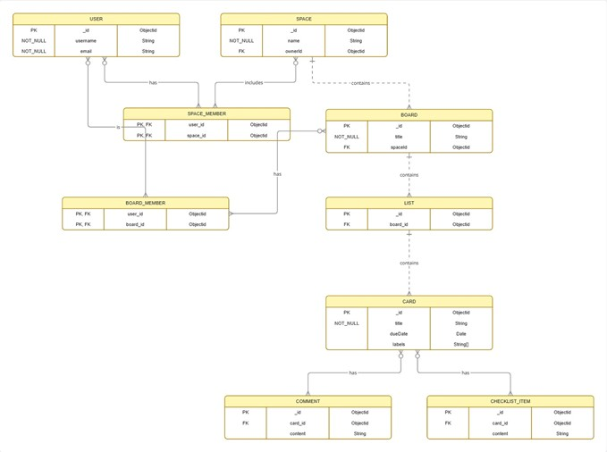

# Project Architecture: Samwise PM Platform

## 1. Executive Summary

Samwise is an AI-enhanced, open-source project management tool designed to bridge the gap between simple, visual Kanban tools and complex enterprise-grade systems[cite: 115, 129, 138]. By integrating Generative AI (Google Gemini) directly into a MERN-stack environment, Samwise automates routine tasks and provides proactive decision-making support[cite: 116, 120, 130].

## 2. Technical Stack & Justification

| Layer            | Technology            | Justification                                                                                      |
| :--------------- | :-------------------- | :------------------------------------------------------------------------------------------------- |
| **Frontend**     | React.js (TypeScript) | Modular, component-based UI with type safety for maintainability[cite: 147, 163, 256].             |
| **Backend**      | Node.js / Express     | Non-blocking, event-driven I/O model handles real-time concurrent requests[cite: 253].             |
| **Database**     | MongoDB               | Document-oriented NoSQL; ideal for hierarchical Kanban data (Board > List > Card)[cite: 247, 248]. |
| **Real-time**    | Socket.io             | Facilitates full-duplex, low-latency collaboration for synchronized team views[cite: 257, 259].    |
| **Intelligence** | Google Gemini API     | Provides contextual project analysis and generative text to automate PM workflows[cite: 153, 173]. |
| **DevOps**       | Docker                | Ensures environment consistency across development and production[cite: 261, 263].                 |

## 3. System Architecture Flow

The system utilizes a client-server architecture[cite: 395]. The React frontend manages state via Redux, communicating with the Express backend via REST APIs and WebSockets[cite: 398, 401].

## 4. Database Schema (ERD)

I designed a logical data model enforced by Mongoose schemas to map the hierarchy between Users, Spaces, Boards, Lists, and Cards[cite: 387, 409].

## 5. Agile/Management Workflow

The project followed the **Project Management Life Cycle (PMLC)** to ensure academic rigor and phased milestones[cite: 158, 289].

- **Planning:** Utilized a Work Breakdown Structure (WBS) to decompose the system into distinct modules: System Core, Frontend, Real-time Service, AI Services, and Documentation[cite: 296, 297].
- **Agile Integration:** Iterative modularity and rapid prototyping ensured that development remained responsive to requirements[cite: 198, 201].
- **Quality Assurance:** A multi-tier testing strategy (Unit, Integration, System, UAT) validated the system against functional requirements[cite: 156, 520].

## 6. Project Artifacts

- [Work Breakdown Structure (WBS)](./diagrams/WBS.png)
- [System Sequence Diagram](./diagrams/sequence.png)
- [High-Level Project Milestones (Summary Image)](./diagrams/gantt.png)
- [Full Detailed Gantt Chart (Microsoft Project)](./artifacts/gantt.mpp)
